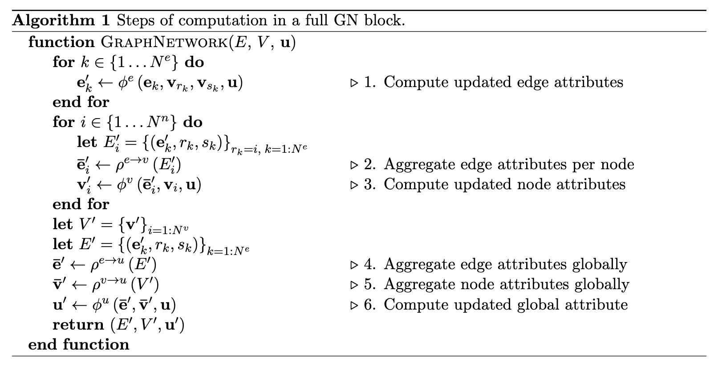

# **graph-networks**

Minimalist implementation of [Relational inductive biases, deep learning, and graph networks](https://arxiv.org/pdf/1806.01261.pdf) in PyTorch.  
This codebase implements the Graph Network (GN) block with all the following components:

- Node, edge and global models: `./models.py`
- Node, edge and global aggregations: `./aggregators.py`

The GN block is then built upon thoses in `./graphnet.py`

The implementation follows the original pseudocode flow in order to follow along (clarity being more important than efficiency here):



To compare with the following code:
```python
def forward(self, E, V, u, r, s):
    E_prime = torch.empty((self.Ne, self.e_dim))
    for k in range(self.Ne):
        e_k, v_rk, v_sk = E[k], V[r[k]], V[s[k]]
        # 1. Compute updated edge attributes
        e_prime_k = self.edge_model(e_k, v_rk, v_sk, u)  
        E_prime[k] = e_prime_k

    V_prime = torch.empty((self.Nn, self.n_dim))
    for i in range(self.Nn):
        if any(r == i):
            E_prime_i = torch.stack([E_prime[k] for k in range(self.Ne) if r[k] == i], dim=0)
            # 2. Aggregate edge attributes per node
            e_prime_bar_i = self.edge_to_node_agg(E_prime_i)  
            # 3. Compute updated node attributes
            v_prime_i = self.node_model(e_prime_bar_i, V[i], u)  
            V_prime[i] = v_prime_i

    # 4. Aggregate edge attributes globally
    e_prime_bar = self.edge_to_global_agg(E_prime)  
    # 5. Aggregate node attributes globally
    v_prime_bar = self.node_to_global_agg(V_prime)  
    # 6. Compute updated global attribute
    u_prime = self.global_model(e_prime_bar, v_prime_bar, u)  

    return E_prime, V_prime, u_prime
```

## Example
A node classifier is trained on the [Zachary's karate club](https://en.wikipedia.org/wiki/Zachary%27s_karate_club) dataset using a GN block and a decoder.  
In order to launch the training, run the main script:
```bash
python main.py
```
This assumes you have pytorch as well as [pyg](https://pytorch-geometric.readthedocs.io/en/latest/) installed.